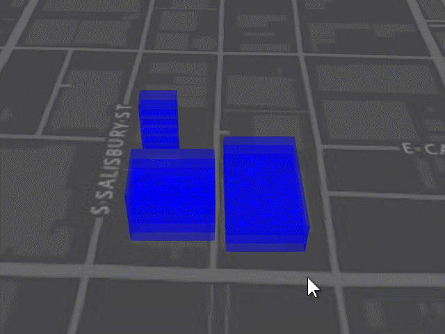

# Building Interaction Sample

This sample demonstrates how to interact with a multi-floor building in three dimensions using [Esri](https://www.esri.com/)'s [ArcGIS API for JavaScript](https://developers.arcgis.com/javascript/) v4.3. With a click and drag operation a building can be intuitively repositioned on the Earth surface. Note that each floor is seperate entity (or [graphic](https://developers.arcgis.com/javascript/latest/api-reference/esri-Graphic.html)) but are grouped as one building when manipulated.

Click [here](https://richiecarmichael.github.io/buildingdrag/index.html) for the live application.

It is important to note that this samples uses some undocumented API calls to achieve this behaviour. As such we caution against using these calls in a production environment as they are unsupported and will very likely change in future releases.

